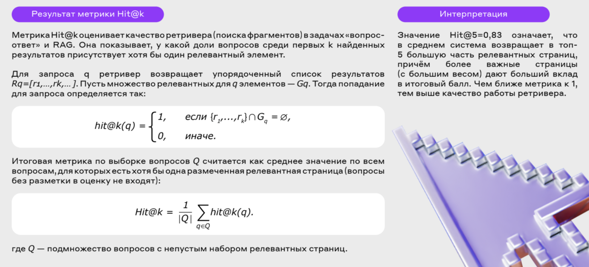

# alfa-hack-rag
Alfa Bank Hackathon

# Постановка задачи
Разработь pipeline RAG-системы, которая по входному вопросу находит релевантные фрагменты в предоставленном корпусе данных.

# Данные
Представленные корпуса текстовых данных:
- вопросы пользователей
- распарсенные с сайта alfabank.ru подстраницы

# Предоставление результата 
Необходимо для каждого вопроса выдать топ 5 наиболее релевантных документа

# Метрика Hit@k

# Результаты

| Hit@k | Модель эмбеддингов | Размер контекста | Размер эмбеддинга | Препроцессинг | Мера близости | 
|-|-|-|-|-|-|
| 32 | ai-forever/FRIDA | 512 | 1536 | Обрезка текста до максимальной длины | Косинусное расстояние |
| 28.4 | deepvk/USER2-base | 8192 | 768 | Обрезка текста до максимальной длины | Косинусное расстояние |
| 27.2 | ai-forever/ru-en-RoSBERTa | 512 | 1024 | Обрезка текста до максимальной длины | Косинусное расстояние |
| 25.5 | deepvk/USER2-small | 8192 | 384 | Обрезка текста до максимальной длины | Косинусное расстояние |
| 19.8 | deepvk/USER-base | ... | ... | Обрезка текста до максимальной длины | Косинусное расстояние |
| 19.3 | intfloat/multilingual-e5-large-instruct | ... | ... | Обрезка текста до максимальной длины | Косинусное расстояние |
| 9.6 | ai-sage/Giga-Embeddings-instruct | 4096 | 2048 | Обрезка текста до максимальной длины | Косинусное расстояние |

usefull links:
- https://habr.com/ru/articles/871226/
- https://blog.deepschool.ru/llm/rag-ot-pervoj-versii-k-rabochemu-resheniyu/
- https://habr.com/ru/articles/797657/